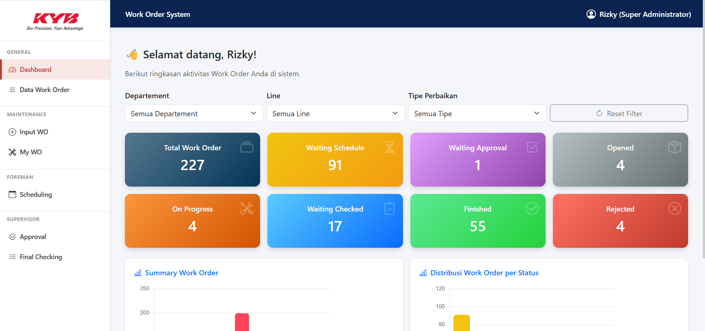
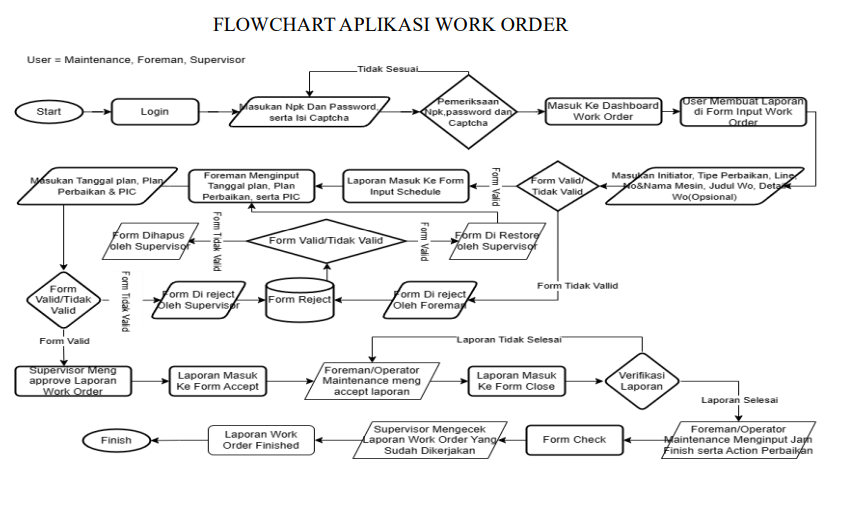

# 🛠️ Work Order Maintenance System – KYB

Sistem Work Order Maintenance digunakan untuk mengelola proses perbaikan atau improvement mesin pada area produksi. Aplikasi berjalan pada lingkungan intranet dan berbasis web menggunakan PHP & MySQL.

## 

## 🚀 Fitur Utama

- Pencatatan Work Order (WO) oleh Maintenance
- Penjadwalan oleh Foreman
- Approval Jadwal oleh Supervisor
- Eksekusi pengerjaan & update status oleh Maintenance
- Final checking oleh Supervisor
- Upload foto Before / After sebagai bukti pekerjaan
- OTP (One Time Password) untuk keamanan login
- Integrasi dengan beberapa database internal

---

## 🏗️ Arsitektur Sistem

**Teknologi**
| Kategori | Teknologi |
|---------|-----------|
| Backend | PHP (prosedural), MySQL |
| Frontend | HTML, Bootstrap, jQuery, SweetAlert2 |
| Chart | Chart.js |
| Mode | Intranet / offline friendly |

**Koneksi Database**
| Database | Fungsi |
|----------|--------|
| `work_order` | inti WO, OTP, scheduling |
| `breakdown` | master mesin (section, line, machine) |
| `lembur1` | master user login (ct_users) |
| `isd` | nomor HP untuk OTP |

---

## 🔐 Mekanisme Login & OTP

### Sumber data user

Login menggunakan tabel `ct_users` pada database `lembur1`.

Role ditentukan dari kolom:

- `golongan`
- `acting`

| Golongan / Acting | Role                |
| ----------------- | ------------------- |
| 1, 2              | Maintenance         |
| 3                 | Foreman             |
| 4 + acting 2      | Supervisor          |
| 4 + acting 1      | Super Administrator |

### Alur Login

1. User input NPK, password, captcha
2. Validasi captcha
3. Validasi user & password
4. Simpan sesi sementara (`pending_*`)
5. Redirect ke OTP

### Alur OTP

1. Generate 6 digit
2. Simpan ke tabel `otp`
3. Kirim ke nomor HP user
4. User verifikasi kode
5. Jika benar → masuk dashboard

---

## 🔑 Role & Hak Akses

| Role        | Hak akses                     |
| ----------- | ----------------------------- |
| Maintenance | Input WO, progress pengerjaan |
| Foreman     | Scheduling WO                 |
| Supervisor  | Approval & Final Checking     |
| Super Admin | Semua akses                   |

---

## 📋 Alur Bisnis Work Order


1️⃣ **Maintenance membuat WO baru**  
→ Status awal: `WAITING SCHEDULE`

2️⃣ **Foreman melakukan scheduling**  
→ Status: `WAITING APPROVAL`

3️⃣ **Supervisor approval**

- Approve → `OPENED`
- Reject → `REJECTED`

4️⃣ **Maintenance mengerjakan WO**

- Start → `ON PROGRESS`
- Finish + upload foto → `WAITING CHECKED`

5️⃣ **Supervisor final checking**

- Approve → `FINISHED`
- Reject → `REJECTED + alasan`

---

## 📸 Upload Foto

| Jenis  | Waktu upload  | Folder            | Kolom DB     |
| ------ | ------------- | ----------------- | ------------ |
| Before | Saat input WO | `uploads/before/` | `fotobefore` |
| After  | Saat finish   | `uploads/after/`  | `fotoafter`  |

---

## 📊 Struktur Tabel Utama

- `work_order`
- `wo_schedule`
- `ct_users`
- `mesin`
- `hp`
- `otp`

(Di PDF tersedia detail lengkap field-nya)

---

## 🖼️ Pengalaman Pengguna

- SweetAlert2 untuk notifikasi, konfirmasi, dan error handling
- Dashboard responsif
- Tabel search + pagination
- Preview foto Before / After full screen

---

## 📦 Instalasi Lokal

```bash
git clone https://github.com/Rizkuy01/work-order-1.git
import sql database sesuai struktur
atur konfigurasi koneksi di config/database.php
akses melalui browser lokal
```
